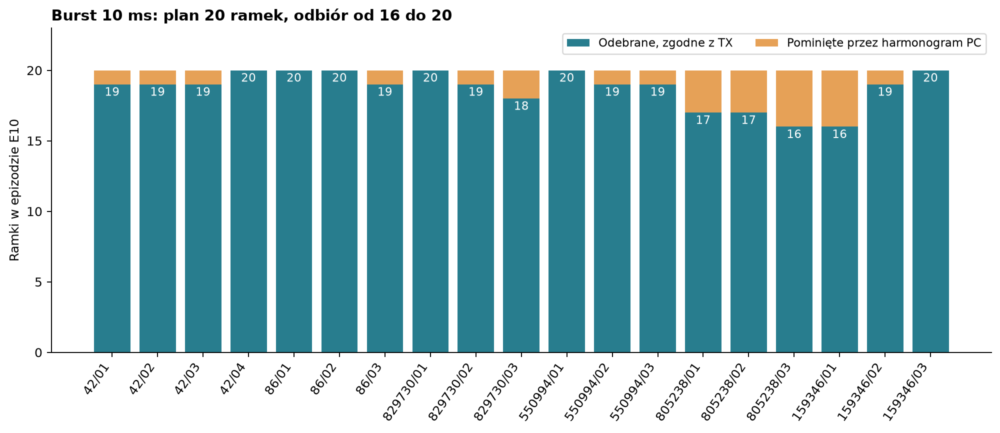
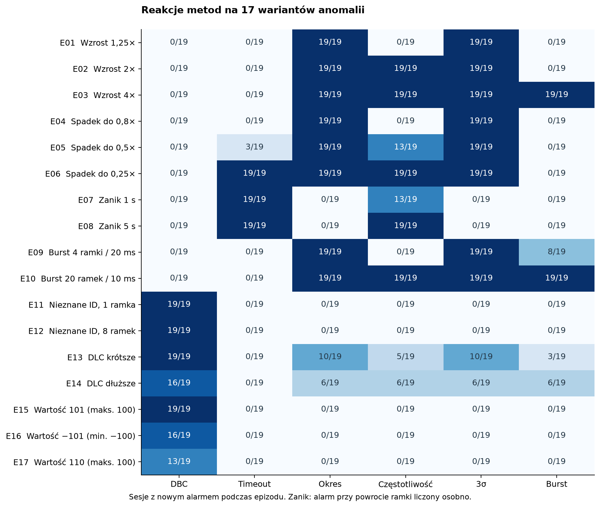
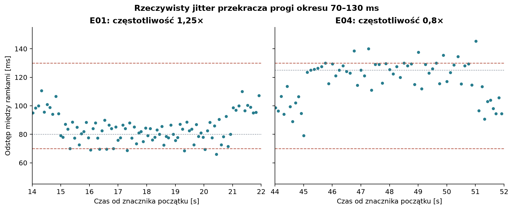
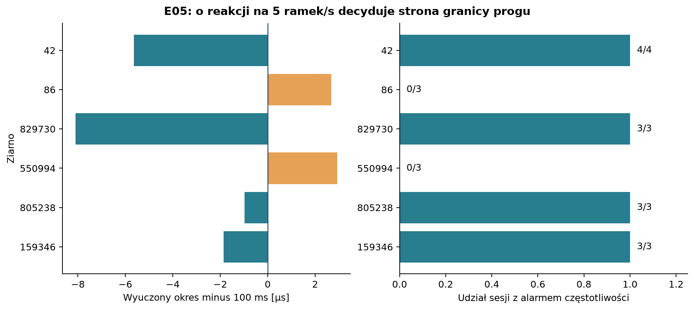
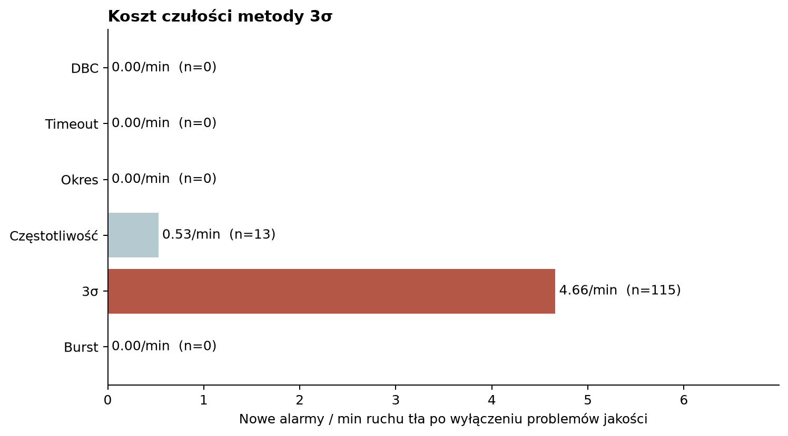

# Weryfikacja pomiarów CAN i materiał do rozdziału wynikowego

Analiza danych pomiarowych z 20.09.2026; wersja oparta na dodanych śladach binarnych.
Źródło liczb: dołączone CSV/JSON oraz manifest SHA-256 każdego użytego pliku. Analiza nie zmienia danych ani ustawień detektora.

## 1. Najważniejsze ustalenia

Zweryfikowano 19 macierzy (323 epizody), smoke_03 (9 epizodów) i sześć kompletnych pomiarów baseline.
Dla ziaren 86, 829730, 550994, 805238 i 159346 są po trzy macierze; dla 42 są cztery.
W dodatkowym katalogu baseline_matrix_seed222720 znajduje się tylko trace.canbin: 14 937 ramek,
bez błędów dekodera, lecz bez profilu i konfiguracji. Został zinwentaryzowany, nie włączony do porównań metod.
Także surowa próba anomaly_seed222720_matrix_01 nie ma pary generatora ani raportów i leży poza sześcioma wskazanymi ziarnami.

W macierzach potwierdzono **244 128 komend TX i 244 126 poprawnie zdekodowanych ramek RX**.
18 macierzy ma pełną zgodność kolejności, ID, DLC i bajtów danych. W seed805238/03 brakuje
dwóch ramek referencyjnych: ID 1317 (0x525) oraz 455 (0x1C7), zaplanowanych na 70,538701 s
i 70,564201 s. Występują podczas E06, ale dotyczą innych ID niż jego cel. Nie znaleziono dodatkowych ramek.
Wszystkie **11 110 potwierdzonych ramek przypisanych przez generator do anomalii** zostały odnalezione w RX.
Zaniki oceniono oddzielnie, ponieważ ich celem jest brak ramek.

**Replay odtwarza dokładnie zapisane alarmy dla 20 testów oraz sześciu kompletnych baseline’ów**.
Odtwarza również sześć profili baseline. To potwierdza powtarzalność analizy zapisanych danych;
nie jest niezależnym dowodem poprawności założeń algorytmu.

Nowy alarm co najmniej jednej metody wystąpił w **311/323 epizodach (96.28%)**.
Metoda podstawowa dla danego typu zareagowała w 256/323. Są to udziały epizodów z nowym
alarmem, nie recall ramek ani ogólna skuteczność IDS. Dwanaście braków nowego alarmu wynika
z ciągłości stanu reguły DBC między zaplanowanymi epizodami. Nie należy przeliczać ich automatycznie
na dwanaście niewykrytych naruszeń sygnału/DLC.

## 2. Jak zweryfikowano dane

1. Sesje połączono według ziaren i numerów prób. Dla 42 raporty są w anomaly_seed42_…,
   a ślady w anomalies_seed42_…; powiązanie potwierdził hash trace.canbin zapisany w raporcie.
2. Sprawdzono SHA-256 śladów, liczbę bajtów/ramek, liczniki zdarzeń i bilans plan = ACK + pominięte.
   Wyniki szczegółowe zawiera validation.csv (887 kontroli, 0 niezgodności).
3. Sprawdzono zgodność DBC, kanału, zbiorów ID i profili. Wszystkie pary macierzy mają zgodne
   ID i profile. Sumy profili zgadzają się po normalizacji CRLF do LF; ich treść JSON jest identyczna.
   Hash kodu detektora odpowiada lokalnej wersji po normalizacji LF. Nie odtwarzano planów nowym
   generatorem: źródłem prawdy są zapisane config.json, truth.json i tx.jsonl.
4. Oś czasu wyznaczono z poprawnych ramek znacznika 0x7FE na początku i końcu każdej sesji.
   Zastosowano liniowe przeliczenie pomiędzy dwoma znacznikami. Wykrycia anomalii nie służą
   już do synchronizacji, więc ocena nie zakłada z góry poprawności detekcji obcego ID.
5. Dopasowano ciąg TX do RX po kolejności i dokładnej treści. Przy dwóch brakach użyto
   ograniczonego wyszukiwania sąsiednich pozycji i zgodności czasu. Różnica czasu wywołania
   komendy PC i czasu RX po synchronizacji dochodzi do około 16 ms. Obejmuje rozdzielczość
   zegara i planowanie PC, transport, adapter oraz odbiór; nie jest pomiarem opóźnienia samego USB.
6. Zdarzenia przypisano do tego samego ID i rzeczywistego początku wstrzyknięcia odczytanego
   ze śladu. Przy zmianach częstotliwości koniec wyznacza powrót pierwszej ramki referencyjnej.
   Reguły okresu i 3σ po powrocie z zaniku są reakcją opóźnioną, a nie wykryciem podczas ciszy.

Wcześniejsze pliki tej analizy bazowały na oszacowaniu czasu z alarmów; zastępuje je bieżąca
wersja. Starszy comparison_report.md w generator/captures/anomalies_smoke_03 pozostaje historycznym
raportem z etapu, gdy trace.canbin nie był dostępny lokalnie.

## 3. Kompletność i jakość macierzy

| Ziarno / próba | TX ACK / RX | E10 RX / plan | Epizody z nowym alarmem | CRC / COBS |
|---|---|---|---|---|
| 42 / 01 | 12472 / 12472 | 19/20 | 16/17 | 6 / 0 |
| 42 / 02 | 12870 / 12870 | 19/20 | 17/17 | 2 / 2 |
| 42 / 03 | 12870 / 12870 | 19/20 | 16/17 | 4 / 0 |
| 42 / 04 | 12871 / 12871 | 20/20 | 16/17 | 4 / 2 |
| 86 / 01 | 12871 / 12871 | 20/20 | 16/17 | 0 / 0 |
| 86 / 02 | 12871 / 12871 | 20/20 | 16/17 | 0 / 0 |
| 86 / 03 | 12870 / 12870 | 19/20 | 16/17 | 0 / 0 |
| 829730 / 01 | 12872 / 12872 | 20/20 | 17/17 | 0 / 0 |
| 829730 / 02 | 12871 / 12871 | 19/20 | 17/17 | 0 / 0 |
| 829730 / 03 | 12870 / 12870 | 18/20 | 17/17 | 0 / 0 |
| 550994 / 01 | 12872 / 12872 | 20/20 | 17/17 | 0 / 0 |
| 550994 / 02 | 12871 / 12871 | 19/20 | 17/17 | 0 / 0 |
| 550994 / 03 | 12871 / 12871 | 19/20 | 17/17 | 0 / 0 |
| 805238 / 01 | 12867 / 12867 | 17/20 | 16/17 | 1 / 0 |
| 805238 / 02 | 12867 / 12867 | 17/20 | 16/17 | 0 / 0 |
| 805238 / 03 | 12866 / 12864 | 16/20 | 16/17 | 1 / 1 |
| 159346 / 01 | 12867 / 12867 | 16/20 | 16/17 | 0 / 0 |
| 159346 / 02 | 12869 / 12869 | 19/20 | 16/17 | 0 / 0 |
| 159346 / 03 | 12870 / 12870 | 20/20 | 16/17 | 0 / 0 |

TX oznacza komendy potwierdzone przez adapter; dopiero dopasowany zapis RX potwierdza obecność
ramki na wejściu loggera. Proporcja 244126/244128 wynosi 99.999181% i opisuje kompletność
tego zapisu, nie skuteczność detekcji. Dwa znaczniki sesji wliczają się do liczby ramek w każdej próbie.

Harmonogram PC pominął łącznie 43 terminy: **24 ramki gęstych burstów E10 oraz 19 ramek
referencyjnych**. E10 zrealizowano w liczbie 356/380 (93,68%). Wszystkie 356 dotarły do loggera.
Zatem wydłużenie interwału do 10 ms poprawiło realizację, ale nie usunęło pominięć.
Na podstawie tych danych nie można przypisać pominięć wyłącznie ograniczeniu przepustowości USB;
potwierdzone jest przekroczenie terminów harmonogramu hosta. Nominalny ruch tła wynosi około
79,4 ramki/s, a w krótkim burście dochodzi około 100 dodatkowych ramek/s.

W macierzach raporty podają 18 błędów CRC strumienia, 5 COBS, jeden zbyt krótki rekord i 13 brakujących rekordów
sekwencji. Rekordy diagnostyczne także należą do strumienia, więc te liczby nie są liczbą
utraconych ramek CAN. To CRC transportu logger–RPi, nie dowód błędów CRC na magistrali CAN.

Luki UART zawężono do sąsiednich poprawnych rekordów śladu. Do analizy wrażliwości dodano
3,05 s po luce lub resecie stanu, aby objąć ponowne napełnienie okien i obserwację okresowych ID.
Maska dotyka 7 epizodów: 42/01: E05; 42/02: E05; 42/02: E16; 42/03: E17; 805238/01: E05; 805238/01: E06; 805238/03: E06.
Po ich wyłączeniu nowy alarm występuje w 304/316 epizodach.
Maska jest konserwatywną zasadą oceny, nie deklaracją, że przez całe 3,05 s występowały błędy.
Szczegóły granic są w quality_audit.csv. Niewielkie błędy nie dyskwalifikują całej sesji.

## 4. Wyniki per scenariusz

Macierz oznacza zestaw kombinacji **typu anomalii i jej intensywności**, powtarzany dla różnych
zestawów ID i faz ruchu. Nie jest to macierz pomyłek TP/FP/TN/FN.
Reguła podstawowa oznacza odpowiednio: częstotliwość dla E01–E06, timeout dla E07–E08,
burst dla E09–E10 oraz właściwy alarm DBC dla E11–E17.

| Epizod / wariant | Plan / ACK / RX | Metoda podstawowa | Dowolna metoda | Stan aktywny przed epizodem¹ |
|---|---|---|---|---|
| E01  Wzrost 1,25× | 1425 / 1425 / 1425 | 0/19 | 19/19 | — |
| E02  Wzrost 2× | 2280 / 2280 / 2280 | 19/19 | 19/19 | — |
| E03  Wzrost 4× | 4560 / 4560 / 4560 | 19/19 | 19/19 | — |
| E04  Spadek do 0,8× | 912 / 912 / 912 | 0/19 | 19/19 | — |
| E05  Spadek do 0,5× | 570 / 570 / 570 | 13/19 | 19/19 | — |
| E06  Spadek do 0,25× | 285 / 285 / 285 | 19/19 | 19/19 | — |
| E07  Zanik 1 s | 0 / 0 / 0 | 19/19 | 19/19 | — |
| E08  Zanik 5 s | 0 / 0 / 0 | 19/19 | 19/19 | — |
| E09  Burst 4 ramki / 20 ms | 76 / 76 / 76 | 8/19 | 19/19 | — |
| E10  Burst 20 ramek / 10 ms | 380 / 356 / 356 | 19/19 | 19/19 | — |
| E11  Nieznane ID, 1 ramka | 19 / 19 / 19 | 19/19 | 19/19 | — |
| E12  Nieznane ID, 8 ramek | 152 / 152 / 152 | 19/19 | 19/19 | — |
| E13  DLC krótsze | 95 / 95 / 95 | 19/19 | 19/19 | — |
| E14  DLC dłuższe | 95 / 95 / 95 | 16/19 | 16/19 | 3 |
| E15  Wartość 101 (maks. 100) | 95 / 95 / 95 | 19/19 | 19/19 | — |
| E16  Wartość −101 (min. −100) | 95 / 95 / 95 | 16/19 | 16/19 | 4 |
| E17  Wartość 110 (maks. 100) | 95 / 95 / 95 | 13/19 | 13/19 | 6 |

¹ Liczba prób, w których model przejść reguły DBC z potwierdzonych ramek TX przewiduje
utrzymanie stanu naruszenia bez nowego wejścia. Zgodność z RX potwierdzono porównaniem ramek.
W E16 liczba 4 jest większa niż liczba braków nowego alarmu (3), ponieważ w seed42/02 błąd
transportu resetuje stan tuż przed E16 i umożliwia ponowny alarm. To efekt resetu, nie wzrost
czułości. Dla E14 brak nowego alarmu dotyczy trzech prób seed86; dla E17 trzech prób seed805238
oraz trzech seed159346. W E16 bez nowego alarmu pozostają seed42/01, /03 i /04.

Przy E13/E14 prawidłowa ramka tego ID musi skasować warunek DLC. W E15–E17 warunek zakresu
kasuje dopiero poprawny sygnał w ramce o właściwym DLC. ID 6 ma okres 10 s, podczas gdy
początki E15/E16/E17 dzieli 8 s. Zależnie od fazy wiadomości poprawna próbka nie występuje
pomiędzy dwoma epizodami. Zmiana wartości 101 na −101 lub 110 wciąż pozostawia aktywny
ten sam warunek naruszenia zakresu. Definicja epizodów w generatorze i definicja wejścia
w stan alarmowy nie są więc tożsame.

Pełne wyniki każdej z 323 realizacji zawiera episodes.csv, w tym ID, plan, ACK, RX, metody,
czasy reakcji, parametry profilu, problemy jakości i przewidywane przejścia DBC.

## 5. Porównanie i interpretacja metod

| Metoda | Wynik charakterystyczny | Ograniczenie interpretacji |
|---|---|---|
| DBC | ID obce 38/38; krótsze DLC 19/19; zakres 101: 19/19 | Nie rejestruje ponownego wejścia, jeśli stan nie został skasowany poprawną ramką |
| Timeout | Zanik 1 s i 5 s: 38/38 | Próg 3T; zgłasza również odstępy 4T przy częstotliwości 0,25× |
| Okres | Wzrost/spadek: 114/114 | Łagodne warianty przekraczają próg dzięki jitterowi; nie są dowodem wykrycia idealnie równych odstępów 80/125 ms |
| Częstotliwość | Wzrost 2×/4× i spadek 0,25×: 57/57 | Łagodne 1,25×/0,8×: 0/38; wariant 0,5×: 13/19 zależnie od profilu |
| 3σ | Reakcja na warianty czasowe | Więcej alarmów tła; silna zależność od wyuczonego odchylenia |
| Burst | Gęsty E10: 19/19; graniczny E09: 8/19 | Rzeczywiste odstępy 20 ms przekraczają czasem limit około 25 ms |
| Kontroler | 0 alarmów w macierzy | Nie wstrzykiwano błędów kontrolera/warstwy fizycznej; skuteczność nieoceniona |

Mapa pokazuje również reakcje dodatkowe. Zero dla metody kontrolującej inną własność nie
oznacza samo w sobie jej nieskuteczności. Trzy reakcje timeout w E05 pojawiają się przy
przejściu z ruchu rzadszego do referencyjnego, gdy ostatni odstęp może przekroczyć 3T;
nie należy interpretować ich jako wykrywania ustalonego okresu 2T przez timeout 3T.

### Łagodne zmiany i jitter

Nominalne odstępy E01 i E04 wynoszą odpowiednio 80 ms i 125 ms. Oba leżą w zakresie
reguły okresu około 70–130 ms. Mimo tego reguła okresu reaguje w 19/19 prób obu wariantów:
zarejestrowane odstępy przekraczają granice wskutek jitteru realizacji ruchu. Dla seed86/01
w E01 występują odstępy około 66–70 ms, a w E04 około 135–140 ms. To potwierdzona detekcja
rzeczywiście otrzymanego ruchu, ale nie dowód, że próg ±30% wykrywa idealną zmianę okresu o −20% lub +25%.

### Próg częstotliwości przy 0,5×

W oknie 1 s przy okresie 100 ms oczekuje się około 10 ramek. Dolny próg przy tolerancji 50%
wynosi około 5, a kod sprawdza ostrą nierówność count < threshold. Wyuczony okres jest
nieznacznie mniejszy od 100 ms dla ziaren 42, 829730, 805238, 159346, więc dolny próg jest
nieznacznie większy od 5 i pięć ramek uruchamia alarm. Dla 86 i 550994 okres jest nieznacznie
większy od 100 ms, próg jest mniejszy od 5 i alarm nie występuje. Odchylenia okresu wynoszą
zaledwie pojedyncze mikrosekundy. To wyjaśnia wynik 13/19, bez odwoływania się do strat ramek.
Podobna wrażliwość na granicę całkowitoliczbową występuje dla ID o okresie 1 s.

### Bursty graniczne

W E09 odebrano wszystkie 76/76 wstrzykniętych ramek. Burst zareagował tylko w 8/19 prób.
Przy czterech ramkach potrzeba trzech kolejnych odstępów poniżej około 25 ms. Mimo planu
20 ms maksymalne odstępy pomiędzy wstrzykniętymi ramkami w poszczególnych próbach dochodzą
do około 30 ms. Niepełna wykrywalność E09 jest więc zgodna z warunkiem reguły i rzeczywistym
rozkładem odstępów. Okres i 3σ reagują w każdej próbie. Dla E10 odebrano 16–20 ramek
na próbę i burst zareagował w 19/19; potwierdza to wykrywanie silniejszego skupienia, choć
nie realizację każdej zaplanowanej intensywności w pełnej liczbie ramek.

## 6. Alarmy tła i czas reakcji

Do tła zaliczono czas od 3,05 s do końca sesji minus 0,05 s, po usunięciu epizodów,
50 ms marginesu przed nimi oraz 1,05 s po nich. Ten margines obejmuje powrót wiadomości
i domknięcie okna częstotliwości. Alarmy innych ID podczas aktywnego wstrzyknięcia są
osobną kategorią w events_audit.csv, bo mogą wynikać z zakłócenia harmonogramu wspólnego generatora.
Po masce jakości pozostaje 24.676 min ruchu tła.

| Metoda | Alarmy tła, wszystkie | Alarmy tła, po masce jakości | Alarmy/min po masce |
|---|---|---|---|
| DBC | 0 | 0 | 0.000 |
| Timeout | 0 | 0 | 0.000 |
| Okres | 0 | 0 | 0.000 |
| Częstotliwość | 13 | 13 | 0.527 |
| 3σ | 118 | 115 | 4.660 |
| Burst | 0 | 0 | 0.000 |

W analizowanym tle 3σ generuje najwięcej alarmów bez zaplanowanej anomalii. Brak alarmów
innych metod w tych przedziałach nie dowodzi zerowego FPR w dowolnych warunkach. Wskaźnik
alarmów/min nie jest FPR: nie zdefiniowano jednostki negatywnej ani liczby TN. Nie podano
precision/F1 z prostego dzielenia liczby zdarzeń przez liczbę wstrzykniętych ramek.
Jedenaście z 13 alarmów częstotliwości w tle pochodzi z seed42/02 i dotyczy ID 1327.
W oknie pojawiają się dwie ramki, a górny próg wynosi około 1,999947. Pozostałe dwa
dotyczą pustych okien ID 1329 w seed550994/02 przy dolnym progu około 0,000037.
To praktyczny skutek granicy progu bliskiej liczbie całkowitej. Reset po błędzie UART
może ponadto przesunąć fazę okien; sam upływ czasu maski jakości nie przywraca ich
poprzedniej fazy. Alarmy tła 3σ występują także w sesjach bez takich błędów.

Przed/po właściwym ruchem występują alarmy braku ramek i spadku częstotliwości. Znaczniki
pozwalają je odciąć; nie należy interpretować ich jako błędów podczas aktywnego scenariusza.
W samych baseline’ach po zamrożeniu profilu i przed końcem ruchu wystąpił jeden alarm 3σ.
Łączny czas takiej obserwacji wynosi tylko 69.867 s.
Nie jest to długi, niezależny zbiór testowy ruchu poprawnego.

| Reguła / zakres | n | Min [s] | Mediana [s] | Max [s] |
|---|---|---|---|---|
| Timeout | 38 | 0.230 | 0.260 | 0.319 |
| Częstotliwość | 57 | 0.307 | 1.031 | 1.698 |
| Burst | 19 | 0.014 | 0.017 | 0.035 |

Czas reakcji burstu jest liczony od pierwszej rzeczywiście odebranej wstrzykniętej ramki;
dla zmian częstotliwości analogicznie, a dla zaniku od początku zaplanowanej ciszy
odniesionego do znaczników. Czas znacznika alarmu pochodzi z urządzenia. Nie zmierzono
osobno czasu dostarczenia alarmu do użytkownika ani opóźnienia zapisu pliku na RPi.
Timeout reaguje przed końcem ciszy; okres i 3σ wymagają następnej ramki i reagują po powrocie.

## 7. Baseline’y

| Ziarno | ACK / RX | ID / okresowe | Uczenie [s] | Ruch po uczeniu [s] | Alarmy przed / po końcu ruchu |
|---|---|---|---|---|---|
| 42 | 15723 / 15636 | 17 / 13 | 180.015 | 16.879 | 0 / 0 |
| 86 | 14805 / 14732 | 16 / 12 | 180.001 | 5.534 | 0 / 0 |
| 829730 | brak / 16674 | 16 / 12 | 180.015 | 29.968 | 0 / 18 |
| 550994 | 14751 / 14691 | 16 / 12 | 180.006 | 5.003 | 1 / 0 |
| 805238 | 14974 / 14764 | 17 / 13 | 180.032 | 5.876 | 0 / 0 |
| 159346 | 14862 / 14817 | 17 / 13 | 180.007 | 6.605 | 0 / 0 |

Wszystkie sześć profili ma ready=true, około 180 s uczenia i poprawne odtworzenie z trace.canbin.
W każdym cztery ID o okresie 10 s nie spełniają minimum 100 odstępów. Są obecne w profilu,
lecz bez modelu czasowego; DBC nadal pozwala kontrolować ich DLC i wartości sygnałów.

W seed86, 159346, 550994 i 805238 cały ciąg RX jest dokładnym prefiksem dziennika TX.
Różnice 73, 45, 60 i 210 ramek występują na końcu, po zakończeniu zapisu odbiornika.
Nie są dowodem strat w środku tych pomiarów. Dla seed42 występuje jeden brak wewnętrzny
(ID 1553, około 159,014 s planu) i 86 ramek nadanych po końcu zapisu RX.
Brak wewnętrzny odpowiada luce sekwencji i błędowi dekodera w tym miejscu; pozostałe błędy
tego baseline’u nie usunęły ramek CAN z dopasowanego ciągu.

Dla baseline seed829730 nadal brakuje dziennika generatora w przekazanym zbiorze. Ślad,
profil i alarmy RPi są spójne, ale nie można zweryfikować planu/ACK tego pomiaru. Jego
18 alarmów (8 timeout, 10 częstotliwości) występuje po ostatniej odebranej ramce,
co potwierdza związek z końcem ruchu. Dodatkowy baseline seed222720 pozostaje niepełny
dokumentacyjnie i wymaga config.json, report.json oraz baseline.json, jeśli miałby wejść do badań.

## 8. Smoke_03 i wydajność RPi

Smoke_03: 9751/9751 ramek zgodnych z TX, 9/9 epizodów z alarmem dowolnej metody i 8/9
z alarmem metody podstawowej. Łagodny wzrost 1,5× wykrywa reguła okresu, a nie częstotliwości.
Gęsty burst zawiera 30/30 ramek. Jeden pominięty termin należy do ruchu referencyjnego.
Problemy jakości występują już po końcu sesji. To poprawny test funkcjonalny, ale ma inne
warianty i intensywności niż macierz, dlatego nie został dodany do jej mianowników.

W 19 macierzach analiza była kompletna, bez przepełnienia kolejki. Udział zmierzonego czasu
przetwarzania analizy w czasie rejestracji wynosi 5.05–5.85%
(mediana 5.42%). Szczyt kolejki to 2–4 z 128 fragmentów, a pamięć rezydentna
30.75–31.00 MiB. To wskazuje na zapas dla badanego ruchu.
Wskaźnik czasu analizy nie jest pomiarem procentowego obciążenia całego CPU ani dowodem
wydajności dla pełnej przepustowości CAN. Ograniczenia realizacji gęstych burstów w tej serii
obserwuje się po stronie harmonogramu generatora.

## 9. Jak przedstawić wyniki w pracy

1. **Tabela stanowiska i kompletności:** sześć baseline’ów oraz zestawienie TX/ACK/RX,
   pominięć harmonogramu i błędów dekodera. Dwa rodzaje strat powinny mieć osobne kolumny.
2. **Mapa reakcji metod (rys. 01):** scenariusze w wierszach, metody w kolumnach,
   w komórkach licznik/mianownik. Podpis wyjaśnia, że to nowe alarmy w epizodach.
3. **Wykres realizacji burstów (rys. 02):** pokazuje oddzielnie to, co zaplanowano,
   pominięto na PC i rzeczywiście odebrano. Uzasadnia użycie rzeczywistej intensywności w analizie.
4. **Wykres alarmów tła (rys. 03):** alarmy na minutę i jawny czas obserwacji,
   jako koszt zwiększonej czułości 3σ. Nie podpisywać go jako FPR.
5. **Dwa wykresy mechanizmów (rys. 04–05):** próg całkowitoliczbowej częstotliwości
   oraz odstępy z rzeczywistego trace.canbin. Wyjaśniają wyniki zamiast tylko je ilustrować.

Do zasadniczego porównania powtarzalności można użyć **18 sesji po 160 s**, po trzy na ziarno,
czyli seed42/02–04 oraz wszystkie próby pozostałych ziaren. Seed42/01 trwa 155 s, choć
obejmuje komplet 17 epizodów; należy pokazać go jako dodatkowy pomiar, a nie usuwać bez opisu.
Dla zestawu 18 sesji wynik nowych alarmów dowolnej metody wynosi
295/306.
W niniejszym raporcie zachowano wszystkie 19, aby nie ukrywać żadnej dostarczonej realizacji.

Próby tego samego ziarna współdzielą profil i układ ruchu. Nie traktować 323 epizodów jako
323 niezależnych losowych obserwacji przy wyznaczaniu przedziałów ufności. Zmienność między
ziarnami i między powtórzeniami należy raportować osobno. Dołączony fragment LaTeX jest
materiałem do adaptacji, nie zastępuje istniejącego rozdziału pracy.

## 10. Wnioski i dalsze pomiary

Badane reguły wykrywają różne własności komunikacji. DBC kontroluje strukturę i semantykę,
timeout pozwala reagować podczas ciszy, okres reaguje na pojedyncze odstępy, częstotliwość
na liczność okna, a burst na krótkie serie. Ich odpowiedzi uzupełniają się; jedna wspólna
liczba „skuteczności” ukrywa tę różnicę. 3σ zwiększa wrażliwość na jitter kosztem alarmów tła.

Obecny zbiór nadaje się do opisania demonstracji i ograniczeń tych metod. Przed finalnymi
metrykami klasyfikacji warto wykonać oddzielny, kilkuminutowy test poprawnego ruchu z już
zamrożonym profilem dla każdego ziarna. Epizody DBC powinny być rozdzielane potwierdzoną
poprawną ramką danego ID lub testowane w osobnych sesjach. Każdy graniczny burst należy
opisywać rzeczywistą liczbą ramek i odstępami z loggera.

Zmianę zasad progowania częstotliwości (kwantyzacja liczności, jawne traktowanie granicy,
ewentualna histereza) oraz zmianę progu 3σ trzeba oceniać jako nową wersję metod, najlepiej
na oddzielnym zbiorze lub w jawnie oznaczonym replay. Nie zmieniono algorytmów po obejrzeniu
wyników i nie podmieniono wyników tej kampanii. Wpływ temperatury pozostaje hipotezą:
w tych danych nie ma zsynchronizowanego pomiaru temperatury, który pozwalałby ją potwierdzić.

## Pliki i odtworzenie

- `analysis.json`, `sessions.csv`, `episodes.csv`: pełne wyniki, parametry i identyfikatory prób.
- `scenario_summary.csv`, `method_summary.csv`: agregaty do tabel i wykresów.
- `events_audit.csv`, `quality_audit.csv`, `missing_rx_frames.csv`: klasyfikacja każdego alarmu, maski jakości i brakujące ramki.
- `baselines.csv`, `profile_parameters.csv`: audyt odniesienia i parametry ID.
- `validation.csv`, `source_manifest.csv`: kontrole spójności i identyfikacja danych źródłowych.
- `figures/`: pięć rysunków w PNG i wektorowym PDF; do LaTeX zalecany PDF.
- `fragment_wyniki.tex`: proponowany fragment tekstu i tabela do adaptacji.

Odtworzenie z katalogu repozytorium: uruchomić `results/analyze_measurement_campaign.py`,
a następnie `results/render_results_report.py` w Pythonie z cantools i matplotlib.
Programy tylko czytają generator/captures i raspberry_pi/captures; wyniki zapisują w results/reports/campaign_2026-09-20.
